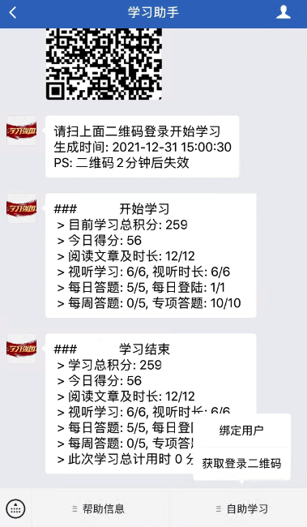
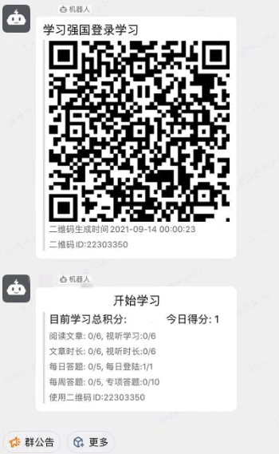

  
  <h1>XueQG</h1>
  
QG学习助手，和您一同学习进步，自用  每天稳定学习45+分  全类型题目答题，多种类文章学习，二维码登录发送等

> 学习过程中有题目和答题选项展示，同时记录相关题目信息到本地User目录以便复习之用

> 目前版本经长期测试，稳定学习，内置打包Chrome最新版浏览器驱动，后台无界面调用

# 说明
欢迎加入讨论组
https://t.me/learnqg
 

**2022.01.01 更新稳定版** 

> 展示版本为Win64版本，如需Liunx运行，请查看获取Docker版本
 最低系统要求`Windows7 64Bit及以上`

> 学习界面演示

 

# Docker 地址 
**2022.01.01更新稳定版** 
> **获取docker镜像** 
`docker pull imkenf/xueqg`

> **相关说明请查看：** 
https://github.com/imkenf/XueQG/blob/main/Docker.md

# 免责声明
使用需严格遵守开源许可协议。本项目仅限于程序开发学习交流之用，严禁用于商业用途，禁止使用本项目进行任何盈利活动。对一切非法使用所产生的后果，我们概不负责。

# 鸣谢
参考源码项目来自https://github.com/TechXueXi/TechXueXi
